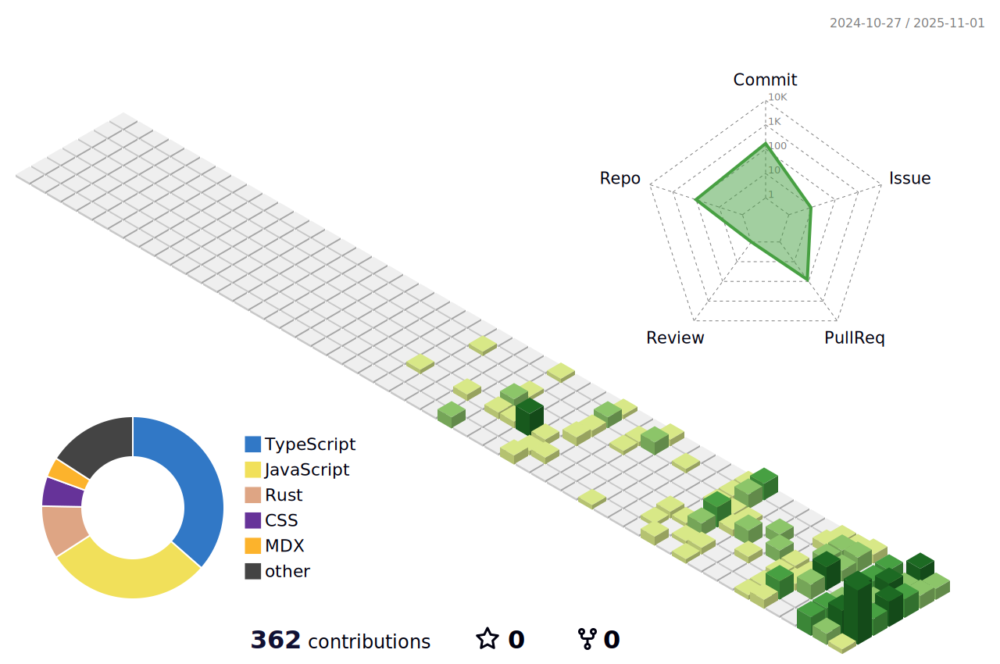
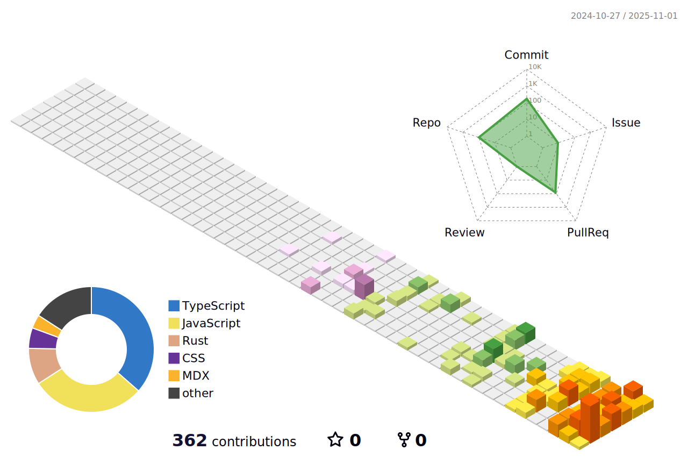
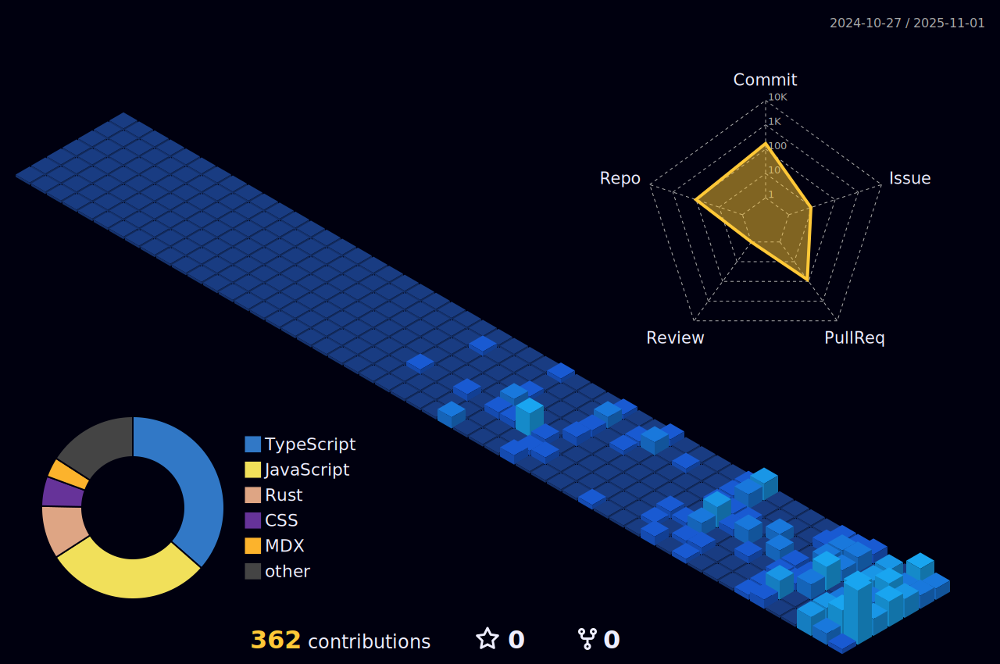
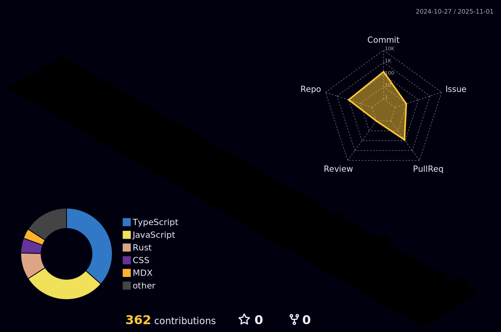
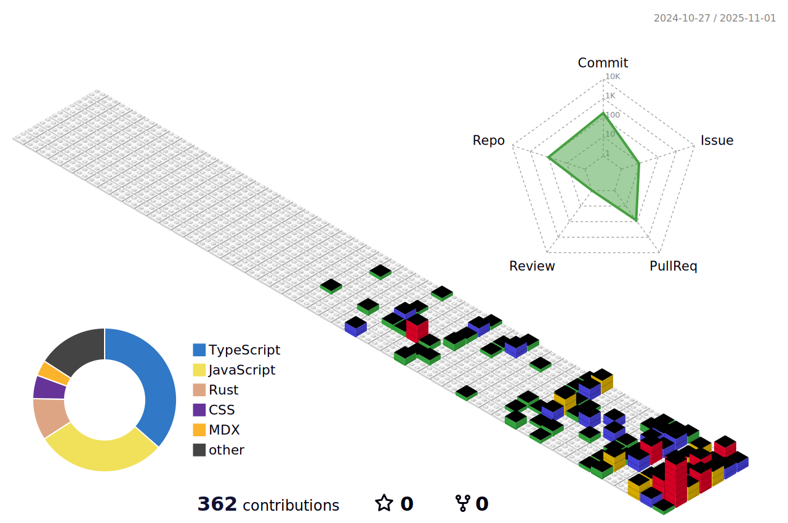

   
Hi, I'm Ritoban – a computer science student working across web development, AI, web3. I focus on building clean, functional solutions and enjoy operating at the intersection of technology, design, and what the market demands.  
Beyond my personal projects, I am an active contributor to the broader open-source community, engaging with codebases outside of my own repositories.

## 💻 Tech I use:

&nbsp;&nbsp;
&nbsp;&nbsp;
&nbsp;&nbsp;
&nbsp;&nbsp;
&nbsp;&nbsp;
&nbsp;&nbsp;
&nbsp;&nbsp;
&nbsp;&nbsp;
&nbsp;&nbsp;
&nbsp;&nbsp;
&nbsp;&nbsp;
&nbsp;&nbsp;
&nbsp;&nbsp;
&nbsp;&nbsp;
&nbsp;&nbsp;
&nbsp;&nbsp;
&nbsp;&nbsp;
&nbsp;&nbsp;
&nbsp;&nbsp;
&nbsp;&nbsp;
&nbsp;&nbsp;
&nbsp;&nbsp;
&nbsp;&nbsp;

<!-- <picture>
  <source media="(prefers-color-scheme: dark)" srcset="https://raw.githubusercontent.com/ritoban23/ritoban23/output/github-snake-dark.svg" />
  <source media="(prefers-color-scheme: light)" srcset="https://raw.githubusercontent.com/riotban23/ritoban23/output/github-snake.svg" />
  
</picture>

  

 -->

<!-- ### Green Animated Version

### Season Version (Northern Hemisphere)
 -->

<!-- ### Night View Version -->

<!-- ### Night Rainbow Version

### Git Block Version
 -->

